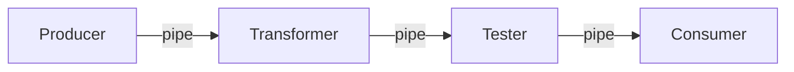
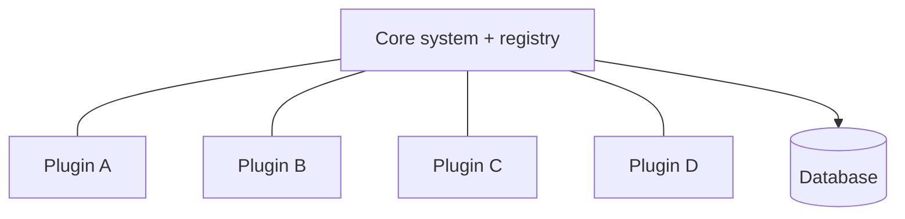
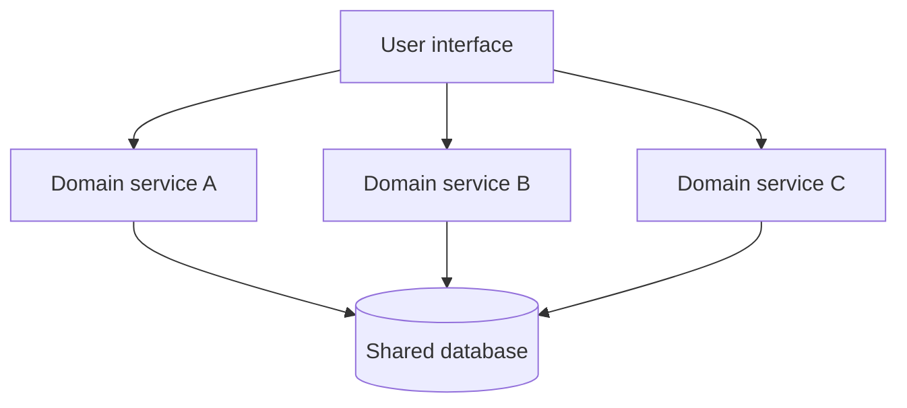
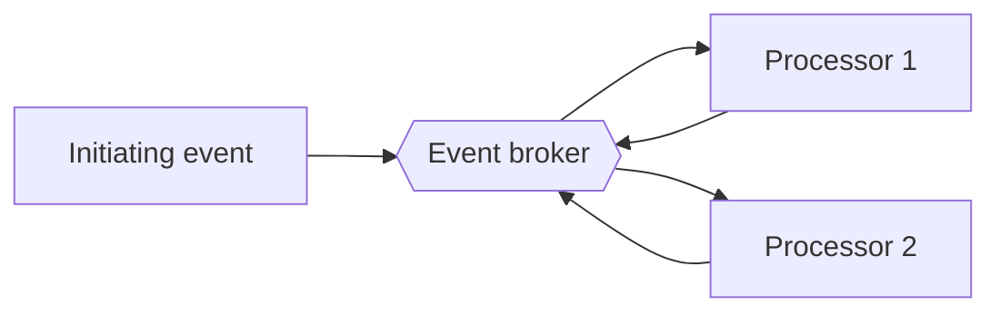
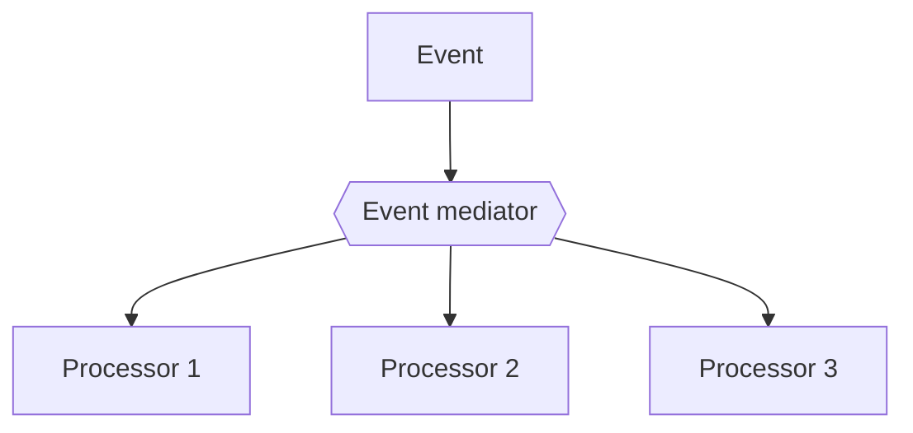
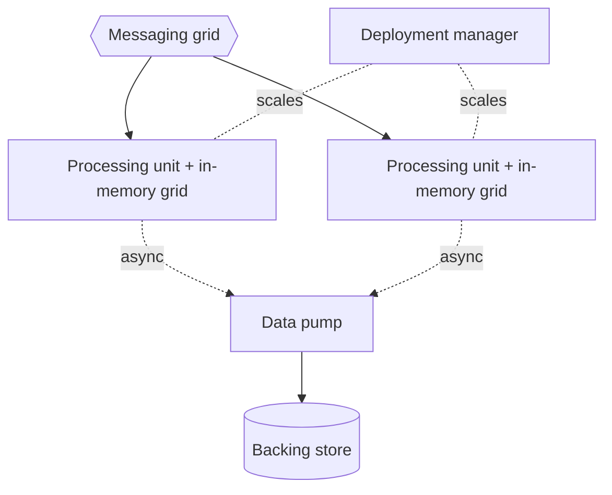
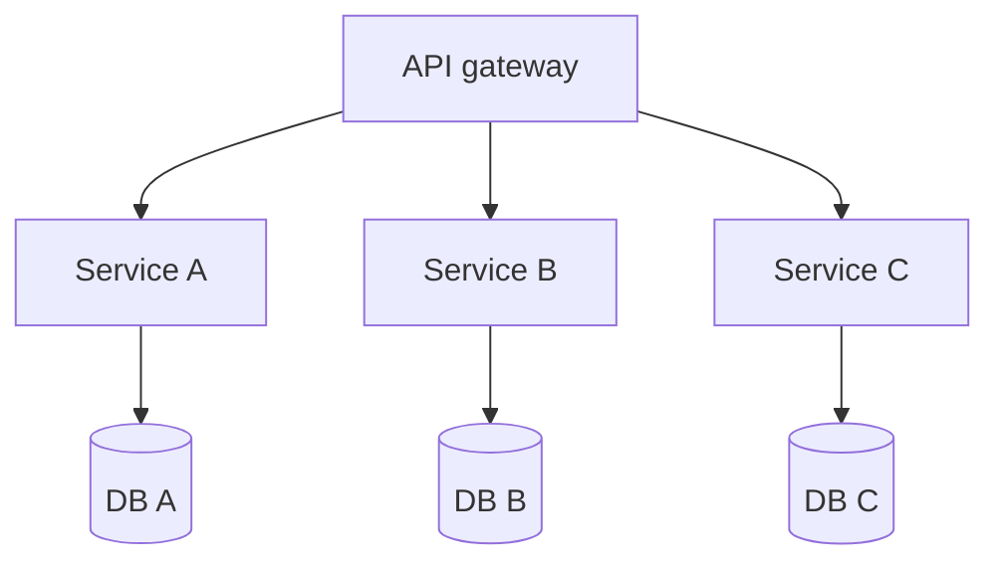
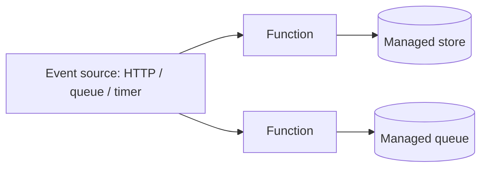
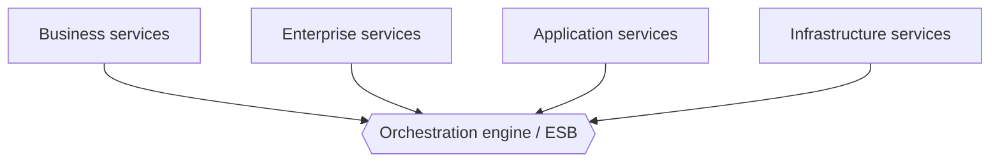

# Architecture styles: when to use, when not

A catalog of the major architecture styles, each with a definition, when it fits, when it does
not, its advantages and disadvantages, a mermaid sketch, and the trade-off scorecard from
Richards & Ford. Use it during step 2 (the proposal's "design it twice"): pick candidate styles
by the decision guide at the end, not by habit.

The first law governs the whole file: **everything here is a trade-off.** No style is best; you
are choosing the least-worst fit for the one to three characteristics that actually drive this
system. See `principles.md` for the laws and for architecture characteristics and fitness
functions.

Scorecards are the per-style figures in _Fundamentals of Software Architecture_ (Richards & Ford,
1st ed., Part II). Ratings are 1–5, 5 strongest; for **cost** and **simplicity**, 5 means
cheapest and simplest. A few cells are reconstructed from the figures and marked
`~approx`; verify against the book before quoting a number as exact. Source list at the end.

## Decision guide (read first)

Three questions place most systems:

1. **One quantum or many?** If the whole system shares one set of characteristics and one data
   store, stay monolithic. Different scaling, fault, or change needs per domain push you to
   multiple quanta (distributed). An architecture quantum is an independently deployable unit with
   high functional cohesion and synchronous coupling; the database usually belongs to it.
2. **Technical or domain partitioning?** Split by technical role (presentation, business,
   persistence) leads to layered or pipeline. Split by business domain (Catalog, Checkout) leads
   to modular monolith, then service-based, then microservices as you need more independence.
3. **Which one to three characteristics drive it?** Match the driver to the style:
   - simplicity and cost first: **layered** or **modular monolith**
   - one-way data transformation: **pipeline**
   - a product with feature plug-ins: **microkernel**
   - agility without distributed pain: **service-based**
   - async throughput and responsiveness: **event-driven** (broker for speed, mediator for control)
   - extreme, spiky concurrency beyond a database: **space-based**
   - many domains, independent everything: **microservices**
   - spiky event glue, scale-to-zero: **serverless**

Then verify the choice with a fitness function per driving characteristic before committing
(`principles.md`). **Monolith first** (Fowler): start monolithic, ideally a modular monolith,
find stable domain boundaries, and extract services only when scale or complexity actually demands
it. https://martinfowler.com/bliki/MonolithFirst.html

## 1. Layered (n-tier) monolith

A technically partitioned monolith of horizontal layers, each calling only the one beneath.

- **Use when:** small or simple apps, tight budget or deadline, teams organized by technical
  skill, or as a starting point before the required characteristics are known.
- **Avoid when:** you need independent scaling, elasticity, fault isolation, or fast independent
  deploys; a large, high-change domain.
- **Advantages:** simple, cheap, familiar; clean separation of technical concerns.
- **Disadvantages:** the "architecture sinkhole" (requests fall through layers doing nothing);
  whole-app redeploy; no elasticity, scalability, or fault tolerance.
- **Scorecard:** cost 5, simplicity 5, reliability 3, performance 2, testability 2, deployability
  1, elasticity 1, scalability 1, fault tolerance 1, modularity 1, evolutionary 1.

```mermaid
graph TD
  P[Presentation] --> B[Business]
  B --> Per[Persistence]
  Per --> D[(Database)]
  subgraph One deployment unit · 1 quantum
    P
    B
    Per
  end
```

## 2. Modular monolith

A single deployment unit partitioned by domain into well-bounded, boundary-enforced modules: a
monolith organized like a set of would-be services.

- **Use when:** domain-aligned teams want microservices-style modularity and evolvability without
  distributed complexity; the explicit "monolith first" starting point.
- **Avoid when:** modules genuinely need different scaling or fault profiles, or independent
  deployment is a hard requirement.
- **Advantages:** high modularity and evolvability without network cost; simpler ops and better
  performance than distributed; a clean path to later extraction.
- **Disadvantages:** boundaries erode without governance (needs a fitness function to stay
  modular); still one quantum, so no independent scaling, elasticity, or fault isolation.
- **Scorecard (`~approx`, 2nd-ed. figure):** cost 4, simplicity 4, modularity 4, evolutionary 4,
  testability 4, reliability 4, deployability 3, performance 3, elasticity 1, scalability 1,
  fault tolerance 2.

```mermaid
graph TD
  subgraph Deployment unit · 1 quantum
    C[Catalog module]
    O[Orders module]
    S[Shipping module]
  end
  C --> DB[(Shared database)]
  O --> DB
  S --> DB
```

## 3. Pipeline (pipes and filters)

A one-way flow of data through composable single-purpose filters (producer, transformer, tester,
consumer) joined by pipes.

- **Use when:** ETL and data transformation, ELT or streaming, EDI, Unix-pipe-style processing;
  any one-way flow built from simple steps.
- **Avoid when:** rich request/response interaction, per-step scaling, or transactional
  consistency across steps.
- **Advantages:** simple, cheap, high modularity (swappable, reusable filters), decent
  testability.
- **Disadvantages:** monolithic deployment, so weak elasticity, scalability, and fault tolerance;
  not for interactive systems.
- **Scorecard:** cost 5, simplicity 5, reliability 4, deployability 3, evolutionary 3, modularity
  3, testability 3, performance 2, elasticity 1, scalability 1, fault tolerance 1.



## 4. Microkernel (plugin)

A minimal core system plus independent plug-ins that add features through a registry and
well-defined contracts, ideally without knowing about each other.

- **Use when:** product-based apps, IDEs, browsers, rules or insurance engines; a stable core with
  varying or customer-specific feature sets.
- **Avoid when:** you need distributed scaling, or the core cannot be kept thin.
- **Advantages:** simple, cheap, strong evolvability via plug-ins, good extensibility and isolated
  plug-in testing.
- **Disadvantages:** monolithic, so limited scalability, elasticity, and fault tolerance; contract
  and version management across plug-ins.
- **Scorecard:** cost 5, simplicity 3, deployability 3, evolutionary 3, testability 3, modularity
  3, performance 3, reliability 3, elasticity 1, scalability 1, fault tolerance 1.



## 5. Service-based architecture

A distributed macro-layered style: a handful (roughly 4–12) of coarse-grained, independently
deployed domain services, usually sharing one monolithic database, often behind a UI, with no
orchestration middleware. The pragmatic middle ground between monolith and microservices.

- **Use when:** you want domain partitioning and independent deployability without the operational
  cost, data decomposition, and distributed complexity of microservices.
- **Avoid when:** services need independent scaling or data, or per-service fault isolation; the
  shared database is a single point of coupling and failure.
- **Advantages:** good deployability, testability, evolvability, and fault tolerance at low cost
  relative to microservices; ordinary database transactions still work within a service.
- **Disadvantages:** the shared database couples services and constrains change; only moderate
  scalability and elasticity.
- **Scorecard:** deployability 4, testability 4, fault tolerance 4, reliability 4, availability 4,
  evolutionary 4, modularity 4, scalability 3, performance 3, simplicity 3, cost 3, elasticity 2.



## 6. Event-driven architecture

A distributed, asynchronous style of decoupled processors reacting to events. Two topologies:
**broker** (no central coordinator, processors chain through a message broker, choreography) and
**mediator** (a central mediator orchestrates the workflow and owns error handling and state).

- **Use when:** high responsiveness and throughput, complex dynamic async workflows, reactive or
  real-time processing. Broker for simple decoupled flows; mediator when you need workflow control,
  error handling, and restart.
- **Avoid when:** you need simple request/response, strong sequential consistency, or easy
  end-to-end testing and debugging.
- **Advantages:** best-in-class performance, scalability, elasticity, and fault tolerance; high
  responsiveness and evolvability.
- **Disadvantages:** hard to test and debug (async, non-deterministic), low simplicity; broker
  topology makes error handling and workflow control difficult; a mediator can become a bottleneck
  and a coupling point.
- **Scorecard:** performance 5, scalability 5, elasticity 5, fault tolerance 5, evolutionary 5,
  modularity 4, deployability 3, reliability 3, cost 3, testability 2, simplicity 1.





## 7. Space-based architecture

Removes the central database as a bottleneck by holding application state in replicated in-memory
data grids; processing units carry data plus logic, and a data pump asynchronously syncs to a
backing store. Named after the tuple space.

- **Use when:** extreme and variable concurrency with unpredictable spikes (ticketing, flash
  sales, auctions) where a database cannot keep up.
- **Avoid when:** strong immediate consistency is needed, cross-aggregate queries are complex,
  load is low or steady (massive overkill), or the team lacks the ops maturity.
- **Advantages:** top elasticity, scalability, and performance; no central database bottleneck.
- **Disadvantages:** very complex and costly; extremely hard to test at scale; eventual
  consistency and data-loss risk on cache sync; steep operational demands.
- **Scorecard:** elasticity 5, scalability 5, performance 5, deployability 3, evolutionary 3,
  fault tolerance 3, modularity 3, reliability 3, cost 1, simplicity 1, testability 1.



## 8. Microservices

Fine-grained, domain-partitioned, independently deployable services, each owning its own data (a
bounded context), sharing nothing, communicating over the network. Each service is its own
quantum.

- **Use when:** distinct domains need different characteristics or scaling, change and deploy rates
  are high and independent, fault isolation matters, and the org has many autonomous teams.
- **Avoid when:** the domain is small or unclear, boundaries are not yet stable, or the team lacks
  automation and ops maturity. See monolith-first.
- **Advantages:** maximal modularity, evolvability, independent deployability, elasticity,
  scalability, and fault tolerance.
- **Disadvantages:** worst on simplicity and cost; performance pays for network hops and the loss
  of distributed transactions (sagas, eventual consistency); high operational and testing cost.
- **Scorecard:** deployability 5, elasticity 5, evolutionary 5, fault tolerance 5, modularity 5,
  scalability 5, reliability 4, testability 4, performance 2, cost 1, simplicity 1.



## 9. Serverless / FaaS (brief)

Functions and managed backend services executed on demand by a cloud provider: no managed servers,
event-triggered, scale-to-zero.

- **Use when:** spiky, unpredictable, event-driven workloads; glue logic; fast time to market;
  pay-per-use economics.
- **Avoid when:** long-running or stateful work, latency-sensitive paths (cold starts), heavy
  inter-function chatter, or vendor lock-in concerns.
- **Advantages:** elasticity and cost efficiency at idle, minimal ops.
- **Disadvantages:** cold-start latency, statelessness constraints, harder observability and
  testing, provider lock-in.



## 10. Orchestration-driven SOA (for contrast)

Enterprise SOA around a central orchestration engine or ESB and a taxonomy of business,
enterprise, application, and infrastructure services. Richards & Ford present it mainly as a
cautionary tale.

- **Use when:** essentially historical enterprise-integration contexts; treated as largely
  obsolete.
- **Avoid when:** almost always today; the central bus and the pursuit of maximal reuse create
  crippling coupling and change amplification.
- **Advantages:** central governance and reuse, in theory.
- **Disadvantages:** worst-in-class evolvability, deployability, testability, and simplicity; the
  ESB is a coupling bottleneck; changes ripple everywhere.
- **Scorecard (`~approx` mid cells):** cost 1, simplicity 1, deployability 1, evolutionary 1,
  testability 1, performance 2, elasticity 3, scalability 3, fault tolerance 3, modularity 3,
  reliability 3.



## Sources

- Richards & Ford, _Fundamentals of Software Architecture_, 1st ed. (O'Reilly, 2020),
  ISBN 978-1492043454, Part II (styles) and ch. 4 (characteristics):
  https://www.oreilly.com/library/view/fundamentals-of-software/9781492043454/ ; 2nd ed. (2025,
  adds the modular-monolith chapter), ISBN 978-1098175511:
  https://www.oreilly.com/library/view/fundamentals-of-software/9781098175504/
- Ford, Richards, Sadalage & Dehghani, _Software Architecture: The Hard Parts_ (O'Reilly, 2021),
  ISBN 978-1492086895 (architecture quantum): https://www.oreilly.com/library/view/software-architecture-the/9781492086888/
- Fowler, "MonolithFirst" (2015): https://martinfowler.com/bliki/MonolithFirst.html ; "Microservice
  Premium": https://martinfowler.com/bliki/MicroservicePremium.html

Scorecard cells marked `~approx` are reconstructed from the book's figures rather than a verbatim
source; confirm against the physical scorecard figures, and pin figure numbers to one edition,
before quoting them as exact.
